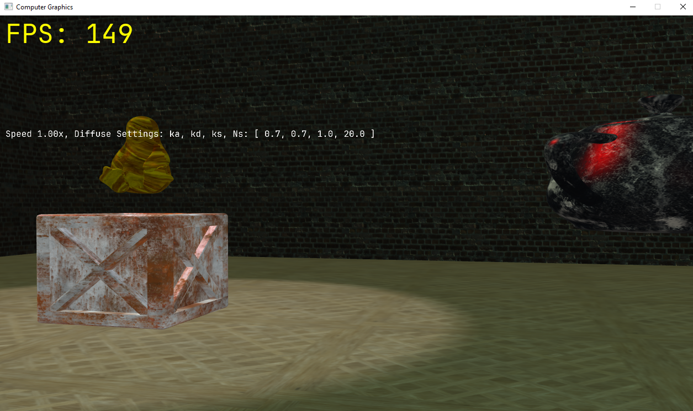

## Controls
- WASD to move while in FPS Camera
- Q + E to swap cameras (0.25s timeout)
- Up + Down to change teapot speed (1s timeout)
- UIOP increase teapot ka, kn, ks, Ns respectively, HJKL decreases - Must be close enough to model for this - text will appear when in range
- T to toggle collider rendering (1s timeout)

## Screenshots

## Video Demo

## Assets
- JetBrains Mono Font: (https://github.com/ryanoasis/nerd-fonts/releases/download/v3.4.0/JetBrainsMono.zip)
- "Tux" (https://skfb.ly/U6Av) by Andy Cuccaro is licensed under Creative Commons Attribution (http://creativecommons.org/licenses/by/4.0/).
- Textures found from (https://ambientcg.com/) - All under CC0 License to attribution not needed